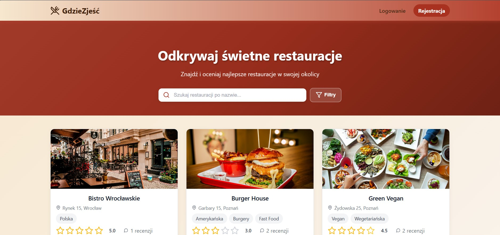

# 🍽️ Restaurants App
A full-stack web application built as a university project, designed to help users discover, review, and manage restaurants. It features user authentication, detailed listings, rating functionality, and a modern, responsive frontend.



## Features
 * 📋 CRUD operations for restaurants
 * 🔎 Search and filter by location, cuisine, rating
 * 🧑‍💻 User authentication (sign-up/login/logout)
 * 📝 Users can add reviews and ratings

## Tech Stack
 * Backend: Node.js
 * Database: MongoDB
 * Frontend: React.js
 * Env/config: dotenv

## Getting Started
Follow these steps to get the app running locally:

1. Clone the repository
``` bash
git clone https://github.com/likpik/restaurants.git
cd restaurants
```
2. Create .env file in the root
```bash
# Server Configuration
PORT=5000
NODE_ENV=development

# Database
MONGODB_URI=mongodb://localhost:27017/restaurant_portal

# JWT Secret
JWT_SECRET=your_super_secret_jwt_key

# Frontend URL
FRONTEND_URL=http://localhost:3000
```

3. Install dependencies
```bash
npm install
```

4. Set up the database

This script populates the database with initial restaurant data.
```bash
node src/scripts/seedDatabase.js
```

5. Run the app
* backend:
```bash
npm start
```
* frontend (in a second terminal):
```bash
cd src/frontend
npm start
```

The app should now be running at http://localhost:3000 (or the PORT you set).

## Usage
* Visit the home page to browse restaurants.
* Sign up and log in to add or edit reviews and restaurants.
* Use search and filters to find restaurants by cuisine or rating.